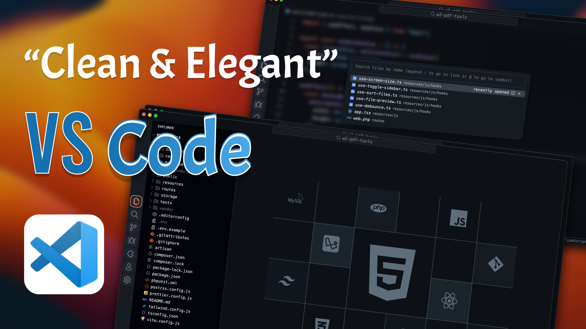

# VSCode Customizations

This guide will help you customize the appearance of Visual Studio Code using the **Custom CSS and JS Loader** extension.

---

### Used Extensions:

- [Github Theme](https://marketplace.visualstudio.com/items?itemName=GitHub.github-vscode-theme)
- [JetBrains Icon Theme](https://marketplace.visualstudio.com/items?itemName=chadalen.vscode-jetbrains-icon-theme)
- [Fluent Icons](https://marketplace.visualstudio.com/items?itemName=miguelsolorio.fluent-icons)
- [Custom CSS and JS Loader](https://marketplace.visualstudio.com/items?itemName=be5invis.vscode-custom-css)

---

### Instructions:

1. **Install the Extensions**
   - Install all the extensions listed above from the VS Code marketplace.

2. **Modify `settings.json`**
   - Add the configuration below to your VS Code `settings.json` file. **Make sure to back up your current settings** as this may overwrite them.

3. **Add the following configuration**:

    ```jsonc
    "vscode_custom_css.imports": [
        // Absolute file paths for your custom CSS/JS files
        // For Mac or Linux:
        // "file:///Users/[your-username]/[path-of-custom-css]/vscode-custom/style.css",
        // "file:///Users/[your-username]/[path-of-custom-css]/vscode-custom/script.js"

        // For Windows:
        // "file:///C:/[path-of-custom-css]/vscode-custom/style.css",
        // "file:///C:/[path-of-custom-css]/vscode-custom/script.js"
    ]
    ```

4. **Enable "Custom CSS and JS Loader"**
   - Open the command palette (`Ctrl+Shift+P` or `Cmd+Shift+P`) and type **"Enable Custom CSS and JS"** to activate the customizations.

5. **Customize Your CSS or JS**
   - Modify the CSS or JS files to change the appearance of Visual Studio Code to your liking. Explore different areas of VS Code that you want to customize.

6. **Reload the Extension**
   - After making any changes to your CSS or JS files, reload the extension from the command palette by selecting **"Reload Custom CSS and JS"**.

---

Feel free to explore and make Visual Studio Code look exactly the way you want it!